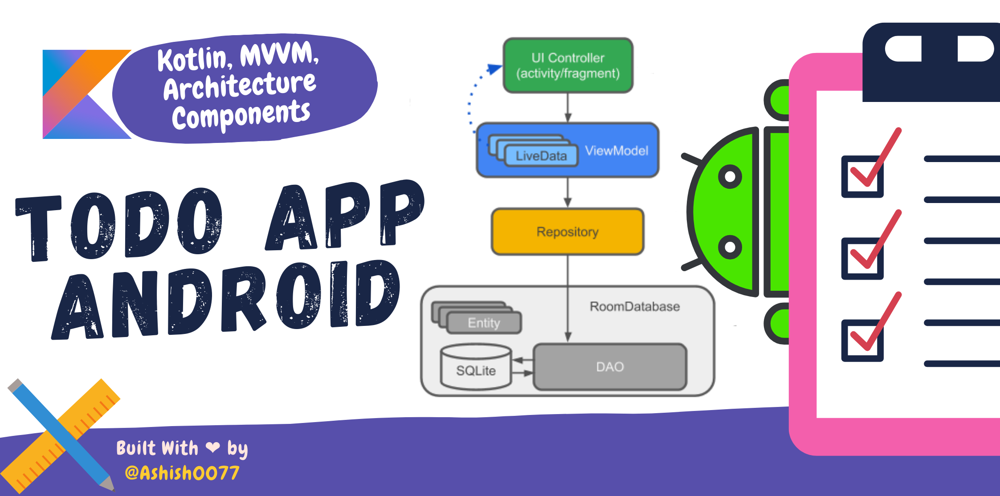
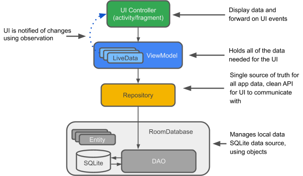

# ToDo App Android



<br>

**ToDo App** is a sample task management android application 📱 built to demonstrate use of *Kotlin, Clean MVVM Architecture, Android Jetpack Architecture Components* tools.

<br>

## Model View ViewModel Architecture



<br>

## Built With 🛠
- [Kotlin](https://kotlinlang.org/) - First class and official programming language for Android development.
- [Coroutines](https://kotlinlang.org/docs/reference/coroutines-overview.html) - A coroutine is a concurrency design pattern that you can use on Android to simplify code that executes asynchronously.
- [Android Architecture Components](https://developer.android.com/topic/libraries/architecture) - Collection of libraries that help you design robust, testable, and maintainable apps.
  - [LiveData](https://developer.android.com/topic/libraries/architecture/livedata) - Data objects that notify views when the underlying database changes.
  - [ViewModel](https://developer.android.com/topic/libraries/architecture/viewmodel) - Stores UI-related data that isn't destroyed on UI changes. 
  - [ViewBinding](https://developer.android.com/topic/libraries/view-binding) - Generates a binding class for each XML layout file present in that module and allows you to more easily write code that interacts with views.
  - [DataBinding](https://developer.android.com/topic/libraries/data-binding) - The Data Binding Library is a support library that allows you to bind UI components in your layouts to data sources in your app using a declarative format rather than programmatically.
  - [Room](https://developer.android.com/topic/libraries/architecture/room) - SQLite object mapping library.
- [Material Components for Android](https://github.com/material-components/material-components-android) - Modular and customizable Material Design UI components for Android.
- [RecyclerView Animators](https://github.com/wasabeef/recyclerview-animators) - About
An Android Animation library which easily add itemanimator to RecyclerView items.

<br>

## Project Directory Structure
```
.
├── app
│   ├── src
│   │   └── main
|   |       ├──/java/com/example/todoapp
│   │       │       ├── data
│   │       │       │   ├── models
│   │       │       │   │   ├── Priority.kt
│   │       │       │   │   └── ToDoData.kt
│   │       │       │   ├── repository
│   │       │       │   │   └── ToDoRepository.kt
│   │       │       │   ├── viewmodel
│   │       │       │   │   └── ToDoViewModel.kt
│   │       │       │   ├── Converter.kt
│   │       │       │   ├── ToDoDao.kt
│   │       │       │   └── ToDoDatabase.kt
│   │       │       ├── fragments
│   │       │       │   ├── add
│   │       │       │   │   └── AddFragment.kt
│   │       │       │   ├── list
│   │       │       │   │   ├── adapter
│   │       │       │   │   │   ├── ListAdapter.kt
│   │       │       │   │   │   └── ToDoDiffUtil.kt
│   │       │       │   │   ├── ListFragment.kt
│   │       │       │   │   └── SwipeToDelete.kt
│   │       │       │   ├── update
│   │       │       │   │   └── UpdateFragment.kt
│   │       │       │   ├── BindingAdapters.kt
│   │       │       │   └── SharedViewModel.kt
│   │       │       ├── utils
│   │       │       │   └── Utils.kt
│   │       │       └── MainActivity.kt
│   │       ├── res
│   │       │   ├── anim
│   │       │   │   ├── from_left.xml
│   │       │   │   ├── from_right.xml
│   │       │   │   ├── to_left.xml
│   │       │   │   └── to_right.xml
│   │       │   ├── drawable
│   │       │   │   ├── custom_input.xml
│   │       │   │   ├── ic_add.xml
│   │       │   │   ├── ic_check.xml
│   │       │   │   ├── ic_launcher_background.xml
│   │       │   │   ├── ic_no_data.xml
│   │       │   │   ├── ic_save.xml
│   │       │   │   ├── ic_search.xml
│   │       │   │   └── item_background.xml
│   │       │   ├── layout
│   │       │   │   ├── activity_main.xml
│   │       │   │   ├── fragment_add.xml
│   │       │   │   ├── fragment_list.xml
│   │       │   │   ├── fragment_update.xml
│   │       │   │   └── row_layout.xml
│   │       │   ├── menu
│   │       │   │   ├── add_fragment_menu.xml
│   │       │   │   ├── list_fragment_menu.xml
│   │       │   │   └── update_fragment_menu.xml
│   │       │   ├── navigation
│   │       │   │   └── my_nav.xml
│   │       │   └── values
│   │       │       ├── colors.xml
│   │       │       ├── strings.xml
│   │       │       └── themes.xml
│   │       └── AndroidManifest.xml
│   ├── build.gradle
│   └── proguard-rules.pro
├── gradle
│   └── wrapper
│       ├── gradle-wrapper.jar
│       └── gradle-wrapper.properties
├── build.gradle
├── gradle.properties
├── gradlew
├── gradlew.bat
├── LICENSE
├── README.MD
└── settings.gradle
```
<br>

### Find this project useful ? ❤️

* Support it by clicking the 🌟 button on the upper right of this page. 🔥

<br>

### License
```
MIT License

Copyright (c) 2021 Ashish Arora

Permission is hereby granted, free of charge, to any person obtaining a copy
of this software and associated documentation files (the "Software"), to deal
in the Software without restriction, including without limitation the rights
to use, copy, modify, merge, publish, distribute, sublicense, and/or sell
copies of the Software, and to permit persons to whom the Software is
furnished to do so, subject to the following conditions:

The above copyright notice and this permission notice shall be included in all
copies or substantial portions of the Software.

THE SOFTWARE IS PROVIDED "AS IS", WITHOUT WARRANTY OF ANY KIND, EXPRESS OR
IMPLIED, INCLUDING BUT NOT LIMITED TO THE WARRANTIES OF MERCHANTABILITY,
FITNESS FOR A PARTICULAR PURPOSE AND NONINFRINGEMENT. IN NO EVENT SHALL THE
AUTHORS OR COPYRIGHT HOLDERS BE LIABLE FOR ANY CLAIM, DAMAGES OR OTHER
LIABILITY, WHETHER IN AN ACTION OF CONTRACT, TORT OR OTHERWISE, ARISING FROM,
OUT OF OR IN CONNECTION WITH THE SOFTWARE OR THE USE OR OTHER DEALINGS IN THE
SOFTWARE.
```
